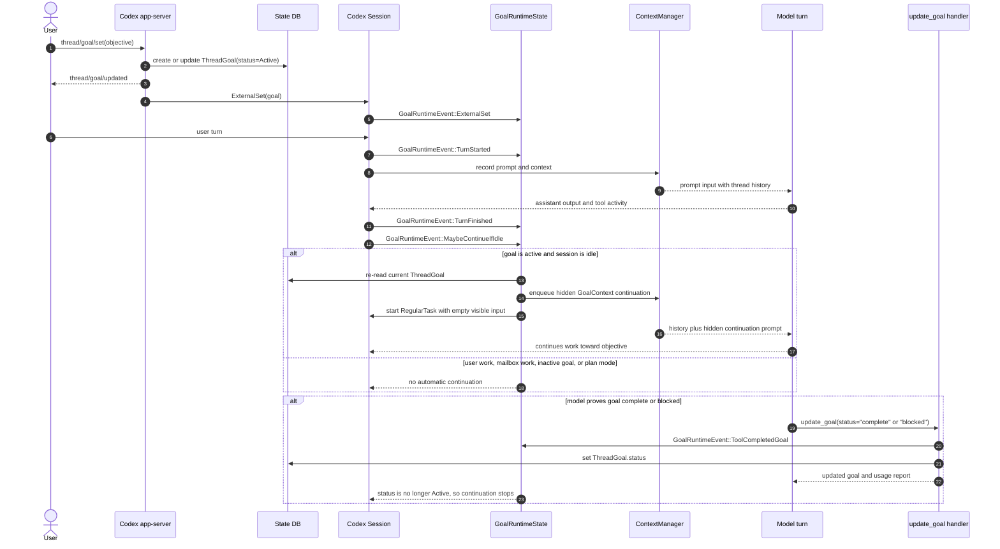
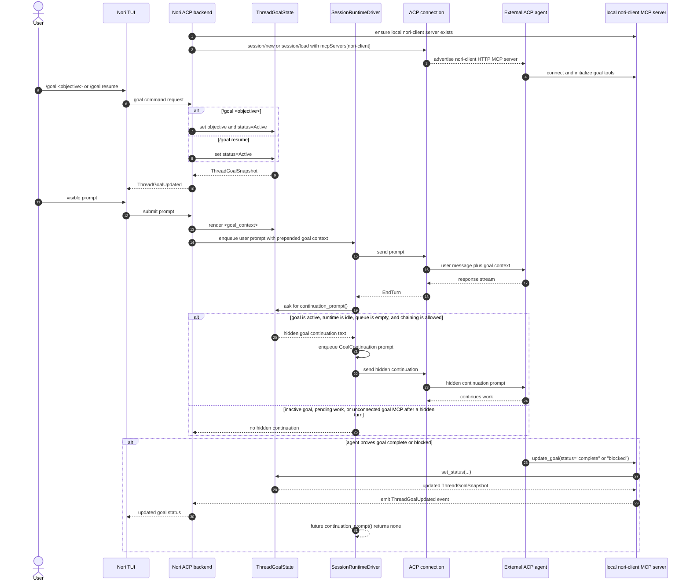

# Goal Command Architecture Diagrams

This note compares two implementations of the same user-facing idea: a long-lived
thread goal that keeps the agent aligned across turns until the model marks the
goal complete or blocked.

- In the raw Codex harness, goals are native session/runtime state.
- In Nori CLI over ACP, goals are owned by the Nori ACP backend and projected
  into an external ACP agent through prompt context plus a local `nori-client`
  MCP server. Nori's built-in Codex launch disables Codex-native goals through
  the adapter configuration, so they cannot compete with this Nori-owned state.

## Raw Codex Harness

Codex keeps the goal loop inside the core harness. The app-server persists the
goal, the running `Session` observes goal lifecycle events, and the model marks
completion through the built-in `update_goal` tool.

### Mermaid Sequence Diagram



### ASCII Overview

```text
User/App
  |
  | thread/goal/set
  v
Codex app-server
  |
  | validate + write ThreadGoal(status=Active)
  v
State DB  -------------------------------+
  |                                      |
  | ExternalSet                          |
  v                                      |
Codex Session + GoalRuntimeState         |
  |                                      |
  | normal user turn                     |
  v                                      |
Model sees session history               |
  |                                      |
  | turn finishes                        |
  v                                      |
MaybeContinueIfIdle                      |
  |                                      |
  | re-read DB; if active goal + idle    |
  v                                      |
Hidden GoalContext continuation ---------+
  |
  | starts another RegularTask in same thread
  v
Model keeps working
  |
  | when evidence proves done or blocked
  v
update_goal(status="complete" | "blocked")
  |
  v
ThreadGoal.status changes; continuation loop stops
```

### Codex Source Notes

- `thread/goal/set` writes the goal through the app-server and applies runtime
  effects to a running thread:
  `../other-repos/codex/codex-rs/app-server/src/request_processors/thread_goal_processor.rs`.
- Goal runtime events and continuation scheduling live in
  `../other-repos/codex/codex-rs/core/src/goals.rs`.
- Hidden continuation text is wrapped as `GoalContext` with `<goal_context>`
  markers in `../other-repos/codex/codex-rs/core/src/context/goal_context.rs`.
- Turns call `MaybeContinueIfIdle` after the active turn is cleared in
  `../other-repos/codex/codex-rs/core/src/tasks/mod.rs`.
- The completion/blocking state transition is the built-in `update_goal` tool in
  `../other-repos/codex/codex-rs/core/src/tools/handlers/goal/update_goal.rs`.

## Nori CLI Over ACP

Nori keeps the user-facing goal state in the ACP backend. During ACP session
setup, it advertises a local `nori-client` MCP server when the agent connection
reports HTTP MCP support. Per turn, it sends goal context to the external ACP
agent as prompt text, and the external agent marks completion/blocking through
`update_goal` from the `nori-client` MCP server. Completion uses the exact
status `complete`. Nori's built-in Codex launch also disables
the adapter's native goals, ensuring only `nori-client` controls Nori thread
goals. Agents without the MCP capability do not get the `/goal` command surface,
because they cannot close the loop by calling the backend-owned goal tools.

### Mermaid Sequence Diagram



### ASCII Overview

```text
ACP session setup
  |
  | if connection supports HTTP MCP
  v
Advertise local nori-client HTTP MCP server
  |
  | external agent connects and initializes tools
  v
External ACP agent has goal tools

-- Goal command --

User / Nori TUI
  |
  | /goal <objective> or /goal resume
  v
Nori ACP backend
  |
  | owns ThreadGoalState
  | emits ThreadGoalUpdated

-- Per-turn steering loop --

Visible user prompt
  |
  | Nori prepends <goal_context>
  v
ACP prompt to agent
  |
  | agent responds, ACP reports EndTurn
  v
SessionRuntimeDriver
  |
  | if goal active + idle + queue empty
  | user turns may start a continuation;
  | hidden turns only chain after goal MCP connects
  v
Hidden GoalContinuation prompt
  |
  | sent over same ACP session
  v
External ACP agent keeps working
  |
  | when evidence proves done or blocked
  v
`update_goal` from the `nori-client` MCP server
  with status="complete" | "blocked"
  |
  v
ThreadGoalState status changes; continuation loop stops
```

### Nori Source Notes

- `ThreadGoalState` renders visible `<goal_context>` and hidden continuation
  text in `nori-rs/harness/src/backend/thread_goal.rs`.
- User prompts are augmented with goal context before submission in
  `nori-rs/harness/src/backend/user_input.rs`.
- The ACP runtime schedules hidden continuations after `EndTurn` in
  `nori-rs/harness/src/backend/session_runtime_driver.rs`.
- Nori registers the local goal MCP server during ACP session setup/load and
  advertises it only when the connection reports HTTP MCP support:
  `nori-rs/harness/src/backend/spawn_and_relay.rs`,
  `nori-rs/harness/src/backend/session.rs`, and
  `nori-rs/harness/src/backend/nori_client_mcp.rs`.
- The backend also projects session capabilities to the TUI. `/goal` is disabled
  when the active agent cannot receive the `nori-client` MCP server, keeping the
  user-facing command surface aligned with the agent's ability to complete or
  block goals.
- The ACP connection forwards `mcpServers` to the external agent when creating a
  session in `nori-rs/acp-host/src/connection/acp_connection.rs`.
- Nori's built-in Codex process selects the maintained ACP adapter and disables
  native goals in `nori-rs/acp-host/src/registry.rs`.
- The local `nori-client` MCP server exposes `get_goal`, `create_goal`, and
  `update_goal` as typed rmcp `#[tool]` handlers on an rmcp `StreamableHttpService`
  (served over a loopback `axum` listener) in
  `nori-rs/harness/src/backend/nori_client_mcp.rs`.
  `nori-client` is Nori's general harness-side channel to the agent; the goal
  tools are its first tenants, not the whole of it. Future tenants should move
  Nori-specific prompt workarounds into MCP prompts/resources, including Nori
  CLI operating context, skill/subagent guidance, local ACP-agent setup help,
  ACP wire-debugging help, and source-code Q&A against the open source Nori CLI
  repo.

## Comparison

| Concern                   | Raw Codex harness                                      | Nori CLI over ACP                                             |
| ------------------------- | ------------------------------------------------------ | ------------------------------------------------------------- |
| Goal state owner          | Codex state DB plus core `Session` runtime             | Nori ACP backend `ThreadGoalState`                            |
| Model-facing goal context | Hidden `GoalContext` response item                     | Prepended prompt text and hidden continuation prompt          |
| Continuation scheduler    | `GoalRuntimeState::MaybeContinueIfIdle`                | `SessionRuntimeDriver::maybe_submit_goal_continuation`        |
| Completion evaluator      | The model self-audits against current evidence         | The external ACP agent self-audits against current evidence   |
| Completion actuator       | Built-in Codex `update_goal` tool                      | `update_goal` from the `nori-client` MCP server               |
| Context window            | Same Codex thread/session history, compacted as needed | External ACP agent's session context, steered by Nori prompts |
| Subagents                 | Separate Codex threads only when explicitly spawned    | Determined by the external ACP agent, not by Nori goal state  |

## Goal Extension Bridge

A third path exists when the ACP agent advertises the `_session/goal`
extension in the top-level `_meta` of its initialize response: the harness
drives the agent's native goal loop over that extension instead of running its
own continuation loop, and mirrors the goal snapshots the agent publishes
(`session_info_update` `_meta.goal`) into `ThreadGoalState` and `GoalChanged`
events. `ThreadGoalState` remains the source of truth for the TUI either way;
only the continuation owner changes. The nori-client MCP loop diagrammed above
stays the fallback for agents without the extension or when an extension call
fails. Contract details: `docs/followups/nori-client-mcp.md`, "Goal Extension
Bridge".

## Mental Model

Both implementations are intentionally simple at the decision point: the model
decides whether the objective is complete or blocked, and a narrow tool changes
goal status. The harness/backend does not independently prove completion. Its
job is to keep the objective visible, continue work while the goal remains
active, persist status, and stop the loop once the status changes.
